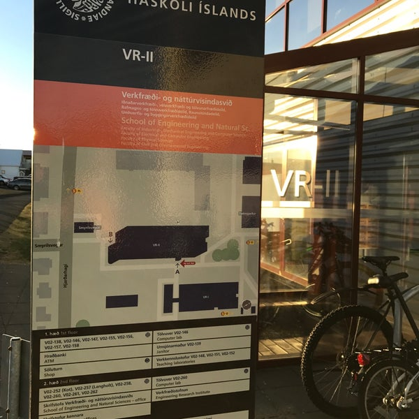



## Námsmarkmiðið er faglegt vinnuferli

Notkun AI-erindreka í fyrirtækjum vex hratt og er að verða nýr staðall. Við þurfum að undirbúa nemendur fyrir vinnu með þeim.

::: {.fa-card cols=3}
- code | **Breyta** | Skrifa kóða og vinna í mörgum skrám
- terminal | **Prófa** | Keyra skipanir og prófanir
- list-check | **Skila** | Undirbúa lausn og leggja til næstu skref
:::

Í IÐN302G læra nemendur faglegt vinnuferli með eigin gögn í teymum:

::: {.steps}
- Afmarka verkefni
- Fela erindreka afmarkað verk
- Prófa og rýna breytingar
- Útskýra niðurstöðuna
- Taka ábyrgð á lokaafurðinni
:::

## Erindrekinn og nemandinn

::: {.oppose left="Erindrekinn getur" right="Nemandinn þarf að geta" left-icon="robot" right-icon="user"}
- Skrifað og breytt kóða | Útskýrt hvað kóðinn gerir
- Breytt mörgum skrám hratt | Afmarkað nauðsynlegar breytingar
- Keyrt skipanir og prófanir | Metið hvort prófanir dugi
- Samið skýrslu | Metið fullyrðingar, rök og niðurstöður
- Unnið hratt og sjálfstætt | Stöðvað, einfaldað og breytt um stefnu
- Búið til sannfærandi lausn | Sannreynt lausnina og tekið ábyrgð
:::

## Kennsluhönnunin gerir mannlega stjórn sýnilega

::: {.steps}
- Markmið og afmörkun
- Erindrekinn framkvæmir
- Nemandinn prófar og rýnir
- Nemandinn ákveður og ber ábyrgð
:::

::: {.fa-card cols=4}
- file-lines | `AGENTS` | Skilgreina verkefnareglur og samhengi
- [hi-teal] clipboard-list | `AGENT_LOG` | Skrá notkun erindrekans og mannlega yfirferð
- [hi-yellow] code-pull-request | **Pull request** | Teymið les, prófar og gagnrýnir afmarkaða breytingu
- [hi-orange] user-check | **iTA** | Verkefnastjóri útskýrir ákvarðanir og vinnulag teymisins
:::

::: {.lead}
Mannleg yfirferð er hluti af verkinu sjálfu, ekki lokaathugasemd eftir að erindrekinn er búinn.
:::

## Niðurstöður eftir fyrstu sjö vikurnar

**Svör úr miðmisseriskönnuninni**

::: {.fa-card cols=2}
- lightbulb | **Áhugi** | Nemendur nefna raunhæf verkefni og áhuga á að kynnast erindrekum
- triangle-exclamation | **Álag** | Umfang, Git-vinnuferli og óskýrar væntingar valda áhyggjum
:::

**Athuganir kennara á vinnuferli teymanna**

::: {.oppose left="Óbeislaður erindreki" right="Taminn erindreki" left-icon="robot" right-icon="user-check"}
- Framleiðir meira og flóknara en teymið nær að yfirfara | Fær afmarkað verkefni sem teymið getur yfirfarið
- Erfiðara að halda yfirsýn og skilningi | Teymið heldur betur yfirsýn og skilningi
:::

::: {.yellow-takeaway}
**Magn og hraði eru ekki mælikvarðar á gæði.** Afmörkun felst líka í að ákveða hvað erindrekinn á ekki að framleiða og hvernig vinnunni er skipt.
:::

## {.focus-slide}

::: {.two-col}
::: {.col}
{.contact-photo style="max-height: 520px;"}
:::

::: {.col}
```{=html}
<h2>Takk fyrir</h2>
<h3>Spurningar?</h3>
```


:::
:::
